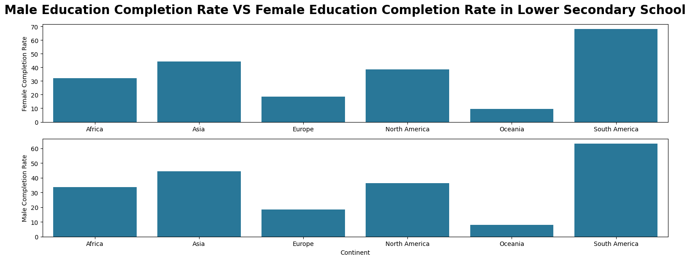

# **Global Education Analysis**

## **Import libraries**

```python
import pandas as pd
import numpy as np
import matplotlib.pyplot as plt
import seaborn as sns
```

## **Data preparation**
``` python
df = pd.read_csv('data/Global_Education.csv')
```
### Explainations of columns
Countries and Areas: Name of the countries and areas.<br>
Latitude: Latitude coordinates of the geographical location.<br>
Longitude: Longitude coordinates of the geographical location.<br>
OOSR_Pre0Primary_Age_Male: Out-of-school rate for pre-primary age males.<br>
OOSR_Pre0Primary_Age_Female: Out-of-school rate for pre-primary age females.<br>
OOSR_Primary_Age_Male: Out-of-school rate for primary age males.<br>
OOSR_Primary_Age_Female: Out-of-school rate for primary age females.<br>
OOSR_Lower_Secondary_Age_Male: Out-of-school rate for lower secondary age males.<br>
OOSR_Lower_Secondary_Age_Female: Out-of-school rate for lower secondary age females.<br>
OOSR_Upper_Secondary_Age_Male: Out-of-school rate for upper secondary age males.<br>
OOSR_Upper_Secondary_Age_Female: Out-of-school rate for upper secondary age females.<br>
Completion_Rate_Primary_Male: Completion rate for primary education among males.<br>
Completion_Rate_Primary_Female: Completion rate for primary education among females.<br>
Completion_Rate_Lower_Secondary_Male: Completion rate for lower secondary education among males.<br>
Completion_Rate_Lower_Secondary_Female: Completion rate for lower secondary education among females.<br>
Completion_Rate_Upper_Secondary_Male: Completion rate for upper secondary education among males.<br>
Completion_Rate_Upper_Secondary_Female: Completion rate for upper secondary education among females.<br>
Grade_2_3_Proficiency_Reading: Proficiency in reading for grade 2-3 students.<br>
Grade_2_3_Proficiency_Math: Proficiency in math for grade 2-3 students.<br>
Primary_End_Proficiency_Reading: Proficiency in reading at the end of primary education.<br>
Primary_End_Proficiency_Math: Proficiency in math at the end of primary education.<br>
Lower_Secondary_End_Proficiency_Reading: Proficiency in reading at the end of lower secondary education.<br>
Lower_Secondary_End_Proficiency_Math: Proficiency in math at the end of lower secondary education.<br>
Youth_15_24_Literacy_Rate_Male: Literacy rate among male youths aged 15-24.<br>
Youth_15_24_Literacy_Rate_Female: Literacy rate among female youths aged 15-24.<br>
Birth_Rate: Birth rate in the respective countries/areas.<br>
Gross_Primary_Education_Enrollment: Gross enrollment in primary education.<br>
Gross_Tertiary_Education_Enrollment: Gross enrollment in tertiary education.<br>
Unemployment_Rate: Unemployment rate in the respective countries/areas.<br>

### Change name of columns 'Countries and areas'
``` python
df.rename(columns={'Countries and areas': 'Countries'}, inplace=True)
```

## **Question 1: What are the differences in education completion rates between genders across different countries?**

### Filter new dataframe that contains completion rate only

``` python
df_complettion = df[['Countries','Completion_Rate_Primary_Male',
       'Completion_Rate_Primary_Female',
       'Completion_Rate_Lower_Secondary_Male',
       'Completion_Rate_Lower_Secondary_Female',
       'Completion_Rate_Upper_Secondary_Male',
       'Completion_Rate_Upper_Secondary_Female']]
```

### Mapping contries to suitable continents

``` python
import pycountry_convert as pc
def country_to_continent(country_name):
    try:
        country_alpha2 = pc.country_name_to_country_alpha2(country_name, cn_name_format="default")
        continent_code = pc.country_alpha2_to_continent_code(country_alpha2)
        continent_name = pc.convert_continent_code_to_continent_name(continent_code)
        return continent_name
    except:
        return None
df_complettion['Continent'] = df_complettion['Countries'].apply(country_to_continent);
```
### Completion rate group by continents

``` python
continents = df_complettion.groupby('Continent').agg({
    'Completion_Rate_Primary_Male': 'mean',
    'Completion_Rate_Primary_Female': 'mean',
    'Completion_Rate_Lower_Secondary_Male': 'mean',
    'Completion_Rate_Lower_Secondary_Female': 'mean',
    'Completion_Rate_Upper_Secondary_Male': 'mean',
    'Completion_Rate_Upper_Secondary_Female': 'mean',
}).reset_index()
```
### Male Education Completion Rate VS Female Education Completion Rate in Primary School

``` python
fig, ax = plt.subplots(2,1,figsize=(15,6))
plt.suptitle('Male Education Completion Rate VS Female Education Completion Rate in Primary School', fontweight = '600', fontsize = 20)
sns.barplot(continents, x='Continent', y='Completion_Rate_Primary_Female', ax=ax[0], color='#177EAA')
ax[0].set_ylabel('Female Completion Rate',  fontweight = '500', fontsize = 15)
ax[0].set_xlabel('')
sns.barplot(continents, x='Continent', y='Completion_Rate_Primary_Male', ax=ax[1], color='#177EAA')
ax[1].set_ylabel('Male Completion Rate',  fontweight = '500', fontsize = 15)
ax[1].set_xlabel('Continent',  fontweight = '500', fontsize = 15)
plt.tight_layout()
```


### Male Education Completion Rate VS Female Education Completion Rate in Lower Seconary School

``` python
fig, ax = plt.subplots(2,1,figsize=(15,6))
plt.suptitle('Male Education Completion Rate VS Female Education Completion Rate in Lower Secondary School', fontweight = '600', fontsize = 20)
sns.barplot(continents, x='Continent', y='Completion_Rate_Lower_Secondary_Female', ax=ax[0], color='#177EAA')
ax[0].set_ylabel('Female Completion Rate')
ax[0].set_xlabel('')
sns.barplot(continents, x='Continent', y='Completion_Rate_Lower_Secondary_Male', ax=ax[1], color='#177EAA')
ax[1].set_ylabel('Male Completion Rate')
plt.tight_layout()
```



### Male Education Completion Rate VS Female Education Completion Rate in Upper Seconary School

``` python
fig, ax = plt.subplots(2,1,figsize=(15,6))
plt.suptitle('Male Education Completion Rate VS Female Education Completion Rate in Upper Secondary School', fontweight = '600', fontsize = 20)
sns.barplot(continents, x='Continent', y='Completion_Rate_Upper_Secondary_Female', ax=ax[0], color='#177EAA')
ax[0].set_ylabel('Female Completion Rate')
ax[0].set_xlabel('')
sns.barplot(continents, x='Continent', y='Completion_Rate_Upper_Secondary_Male', ax=ax[1], color='#177EAA')
ax[1].set_ylabel('Male Completion Rate')
plt.tight_layout()
```


## **What is the relationship between birth rates and education completion rates?**
